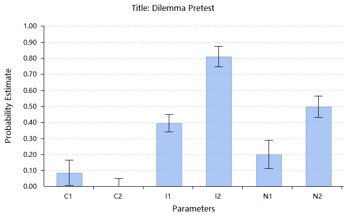

 
```{r library, include=FALSE}

library(tidyverse)
library(rio)
library(summarytools)
library(plotly)
library(yaml)
library(psych)
library(ggstatsplot)# a powerful stat tool
library(formattable)
library(data.table)
library(vegan) 
library(cluster)    # clustering algorithms
library(factoextra) # clustering visualization
library(dendextend) # for comparing two dendrograms
library(xlsx)
library(ggcorrplot)
library(xaringan)
library(xaringanthemer)
library(reshape) 
``` 


```{r setup, include=FALSE}
options(htmltools.dir.version = FALSE)
options(servr.daemon = TRUE)
```

---
class: center, middle, inverse
## What we are going to discuss about


### 1.To identify proper dilemmas (i.e., exclude the 'low quality' ones)

--

### 2.To idientify those people with deontological and utilitarian preference by checking whether they behave consistently

--

### 3.To validate this classification by testing the difference across a series of measurements.

```{r xaringan-themer, include=FALSE}
library(xaringanthemer)
mono_light(base_color = "#23395b")
```

```{r echo=FALSE,results=F,message=F,warning=F}
data <- import("E:/Zengxiaoyu/zxy_projcet/NSVS/02data/02cleand data/NSVS_onlinepilot_CNI_V2.csv", setclass = "data.table")
## overview of our data
#print(dfSummary(data, valid.col = FALSE, graph.magnif = 0.75), 
#      max.tbl.height = 300, method = "render")
data$ID <- 1:nrow(data)
```

---

## Overview of all **24** dilemmas
```{r echo=FALSE,message=F,warning=F,fig.height=3.5, dev='svg'}
#data clean
##gender input
data$gender <- data$Q55
data$gender[data$gender=="2"]<-'Females'
data$gender[data$gender=="1"]<-'Males'
gender <- data$gender
##dilemma dataframe
acinc_df <- data.frame(data$Q19,data$Q196,data$Q110,data$Q122,data$Q128,data$Q130)
accon_df <- data.frame(data$Q106,data$Q108,data$Q120,data$Q124,data$Q126,data$Q135)
ininc_df <- data.frame(data$Q94,data$Q97,data$Q101,data$Q104,data$Q191,data$Q132)
incon_df <- data.frame(data$Q99,data$Q113,data$Q114,data$Q116,data$Q118,data$Q134)

all_dilemma_df <- data.frame(data$Q19,data$Q196,data$Q110,data$Q122,data$Q128,data$Q130,
                             data$Q106,data$Q108,data$Q120,data$Q124,data$Q126,data$Q135,
                             data$Q94,data$Q97,data$Q101,data$Q104,data$Q191,data$Q132,
                             data$Q99,data$Q113,data$Q114,data$Q116,data$Q118,data$Q134)

acinc_df[acinc_df=="2"]<-0
acinc_df[acinc_df=="4"]<-1
acinc_df[acinc_df=="5"]<-0
accon_df[accon_df=='2']<-0

ininc_df[ininc_df=="2"]<-0
incon_df[incon_df=="2"]<-0
ininc_df[ininc_df=="4"]<-1
ininc_df[ininc_df=="5"]<-0

all_dilemma_df[all_dilemma_df=="2"]<-0
all_dilemma_df[all_dilemma_df=="4"]<-1
all_dilemma_df[all_dilemma_df=="5"]<-0


acinc_dt <- as.data.table(acinc_df)
accon_dt <- as.data.table(accon_df)
ininc_dt <- as.data.table(ininc_df)
incon_dt <- as.data.table(incon_df)
all_dilemma_dt <- as.data.table(all_dilemma_df)

long_acinc_dt <- melt(acinc_dt,
     measure.vars=patterns('^data.Q'),
     variable.names='dilemmas',
     value.name=c('choices')
     )
long_accon_dt <- melt(accon_dt,
     measure.vars=patterns('^data.Q'),
     variable.names='dilemmas',
     value.name=c('choices')
     )
long_incon_dt <- melt(incon_dt,
     measure.vars=patterns('^data.Q'),
     variable.names='dilemmas',
     value.name=c('choices')
     )
long_ininc_dt <- melt(ininc_dt,
     measure.vars=patterns('^data.Q'),
     variable.names='dilemmas',
     value.name=c('choices')
     )
# long_all_dilemma_dt <- melt(all_dilemma_dt,
#      measure.vars=patterns('^data.Q'),
#      variable.names='dilemmas',
#      value.name=c('choices')
#      )

dilemmadata <- data.frame(long_acinc_dt,long_accon_dt,long_incon_dt,long_ininc_dt)
#print(dfSummary(dilemmadata, valid.col = FALSE, graph.magnif = 0.75), 
#      max.tbl.height = 300, method = "render")
print(dfSummary(all_dilemma_dt, valid.col = FALSE, graph.magnif = 0.75), 
      max.tbl.height = 300, method = "render")
```

---

## **Action** in incongruent and congruent dilemmas
#### **Four** potential 'low quality' dilemmas
.pull-left[*Say YES to **incongruent** dilemmas*
1. 51.2%:牺牲人质否决支付赎金给恐怖分子买武器

1. **20.2%:杀一个人移植其器官，救其他没器官就会死的人**

1. **69%:为一心求死但暂时健康的绝症病人提供致命药物**

1. 41.7%:给会传染对老人小孩致命病毒留学生致命药物

1. 47.6%:使用疫苗让数十人死亡、数百人获救

1. **72.6%:为拯救被困可能脱水致死的小孩，对犯人使用酷刑**
]

.pull-right[*Say YES to **congruent** dilemmas*
1. 27.4%:使用疫苗让数十人死亡、同等数量的数十人获救

1. 38.1%:给会传染胃痉挛病毒的留学生致命药物

1. 30.9%:为防止丢失名画被运出国，对犯人使用酷刑

1. 26.2%:为一心求死但暂时健康且很快就会康复的病人提供致命药物

1. 21.4%:杀一个人移植其器官，救其他没器官以后不太健康的人

1. **47.6%:牺牲人质否决支付赎金给恐怖分子买食物**
]

---
## **Inaction** in incongruent and congruent dilemmas

.pull-left[*Say YES to **incongruent** dilemmas*
1. **64.3%:举报同事使用疫苗让数十人死亡、数百人获救**

1. 42.9%:将会给老人小孩传染致命病毒的留学生可能死于此病毒的留学生带出隔离器回国治疗

1. 45.2%:举报同事为拯救被困可能脱水致死的小孩，对犯人使用酷刑

1. **76.2%:举报同事杀一个人移植其器官，救其他没器官就会死的人**

1. 45.2%:拯救人质支付赎金给恐怖分子买武器

1. **67.9%:为一心求死但心脏病发作的绝症病人提供药物**
]

.pull-right[*Say YES to **congruent** dilemmas*
1. 73.8%:为一心求死、心脏病发作但很快就会好起来的的绝症病人提供药物

1. 65.5%:举报同事 为防止丢失名画被运出国，对犯人使用酷刑

1. 72.6%:举报同事杀一个人移植其器官，救其他没器官以后不太健康的人

1. 69%:举报同事使用疫苗让数十人死亡、同等数量的数十人获救

1. **89.3%:拯救人质支付赎金给恐怖分子买食物**

1. **45.2%:将传染胃溃疡的可能死于此病毒的留学生带出隔离器回国治疗**
]

??同样地，在本来情况是inaction 的dilemma里面，我们也发现了5个dilemma是区分质量比较低的
---
class: center
## Consistent rate of saying YES in two types dilemmas

```{r echo=FALSE,}
# data pre
data$acinc <- (acinc_df$data.Q19+acinc_df$data.Q196+acinc_df$data.Q110+acinc_df$data.Q122+acinc_df$data.Q128+acinc_df$data.Q130)
data$accon <- (accon_df$data.Q106+accon_df$data.Q108+accon_df$data.Q120+accon_df$data.Q124+accon_df$data.Q126+accon_df$data.Q135)
data$ininc <- (ininc_df$data.Q94+ininc_df$data.Q97+ininc_df$data.Q101+ininc_df$data.Q104+ininc_df$data.Q191+ininc_df$data.Q132)
data$incon <- (incon_df$data.Q99+incon_df$data.Q113+incon_df$data.Q114+incon_df$data.Q116+incon_df$data.Q118+incon_df$data.Q134)

data$perc_acinc <-  data$acinc/6
data$perc_accon <-  data$accon/6
data$perc_ininc <-  data$ininc/3
data$perc_incon <-  data$incon/4
```


```{r echo=FALSE,fig.height=5,fig.width=10}

p1 <- ggplot(data, aes(perc_acinc, perc_accon,color=gender)) +
  geom_count(alpha=0.4)+
  theme_classic()+
  labs(x='Say YES in incongruent dilemmas',
       y='Say YES in congruent dilemmas')

ggplotly(p1)
```

.footnote[[*]Utili:high X, low Y;
Deon:low X, low Y]


```{r echo=FALSE}
# data pre
data$acinc_2 <- (acinc_df$data.Q19+acinc_df$data.Q110+acinc_df$data.Q122+acinc_df$data.Q128+acinc_df$data.Q130)
data$accon_2 <- (accon_df$data.Q106+accon_df$data.Q108+accon_df$data.Q120+accon_df$data.Q124+accon_df$data.Q126)
data$acinc_3 <- (acinc_df$data.Q19+acinc_df$data.Q110+acinc_df$data.Q122+acinc_df$data.Q128)

data$acinc_4 <- (acinc_df$data.Q19+acinc_df$data.Q122+acinc_df$data.Q128)

data$ininc <- (ininc_df$data.Q94+ininc_df$data.Q97+ininc_df$data.Q101+ininc_df$data.Q104+ininc_df$data.Q191+ininc_df$data.Q132)

data$incon <- (incon_df$data.Q99+incon_df$data.Q113+incon_df$data.Q114+incon_df$data.Q116+incon_df$data.Q118+incon_df$data.Q134)

data$perc_acinc_2 <-  data$acinc_2/5

data$perc_accon_2 <-  data$accon_2/5

data$perc_acinc_3 <-  data$acinc_3/4

data$perc_acinc_4 <-  data$acinc_4/3

data$perc_ininc <-  data$ininc/6
data$perc_incon <-  data$incon/6

##
data$ininc_2 <- (ininc_df$data.Q97+ininc_df$data.Q101+ininc_df$data.Q191)

data$incon_2 <- (incon_df$data.Q99+incon_df$data.Q113+incon_df$data.Q114+incon_df$data.Q116)

data$perc_ininc_2 <-  data$ininc_2/3
data$perc_incon_2 <-  data$incon_2/4
```

```{r echo=FALSE,results=F,fig.height=5,fig.width=10}

p3 <- ggplot(data, aes(perc_acinc_3, perc_accon_2,color=gender)) +
  geom_count(alpha=0.4)+
  theme_classic()+
  labs(x='Say YES in incongruent dilemmas',
       y='Say YES in congruent dilemmas')
#ggplotly(p2)
#p3
```


---
class: center

## Consistent rate of saying YES in two types dilemmas (delete 4 unqualified dilemmas)

```{r echo=FALSE,fig.height=5,fig.width=10}

p4 <- ggplot(data, aes(perc_acinc_4, perc_accon_2,color=gender)) +
  geom_count(alpha=0.4)+
  theme_classic()+
  labs(x='Say YES in incongruent dilemmas',
       y='Say YES in congruent dilemmas')
ggplotly(p4)
#p4
```

.footnote[[*]Utili:high X, low Y;
Deon:low X, low Y]

---
class: inverse, center, middle

## Basically, we can find two extreme group.

--

## But an additional cluster analysis would be more informative.

```{r echo=FALSE,fig.height=5,fig.width=7}
#k-means clustering is unsupervised machine learning 
# data pre
clusterdata <- data.frame(data$perc_acinc,data$perc_accon)
clusterdata_3 <- data.frame(data$perc_acinc_3,data$perc_accon_2)
clusterdata_4 <- data.frame(data$perc_acinc_4,data$perc_accon_2)
# cluster
distance <- get_dist(clusterdata)
distance_3 <- get_dist(clusterdata_3)
distance_4 <- get_dist(clusterdata_4)
#fviz_dist(distance, gradient = list(low = "#00AFBB", mid = "white", high = "#FC4E07"))

```

---

class:center

## Clustering analysis based on consistent ratio of saying YES in two types dilemmas(all 12 dilemmas)

```{r echo=FALSE,fig.height=4,fig.width=5, dev='svg',warning=FALSE}
k2 <- kmeans(clusterdata, centers = 4, nstart = 25)
k3 <- kmeans(clusterdata_3, centers = 4, nstart = 25)
k4 <- kmeans(clusterdata_4, centers = 4, nstart = 25)

#data$NOcluster <- k2$cluster
#str(k2)

fviz_cluster(k2, geom = "point",data = clusterdata,
             palette = "Set2",ellipse=TRUE,
             ellipse.type = "euclid")+theme_classic()+
  labs(x='Saying YES in incongruent dilemmas',y='Saying YES in congruent dilemmas')

```

.footnote[19,X=0.16,Y=0.05;
26,X=0.41,Y=0.27;
27,X=0.73,Y=0.32;
12,X=0.75,Y=0.85
]


```{r echo=FALSE,results=F,fig.height=4,fig.width=5, dev='svg',warning=FALSE}
# k2 <- kmeans(clusterdata, centers = 4, nstart = 25)
# k3 <- kmeans(clusterdata_3, centers = 4, nstart = 25)
# k4 <- kmeans(clusterdata_4, centers = 4, nstart = 25)
# 
# #k2$cluster
# #data$NOcluster <- k2$cluster
# #str(k2)
# fviz_cluster(k3, geom = "point",data = clusterdata_3,
#              palette = "Set2",ellipse=TRUE,
#              ellipse.type = "euclid")+theme_classic()+
#   labs(x='Saying YES in incongruent dilemmas',y='Saying YES in congruent dilemmas')

```

---
class:center

## Clustering analysis based on consistent ratio of saying YES in two types dilemmas(-4 dilemmas)

```{r echo=FALSE,fig.height=4,fig.width=5, dev='svg',warning=FALSE}
k2 <- kmeans(clusterdata, centers = 4, nstart = 50)
k3 <- kmeans(clusterdata_3, centers = 4, nstart = 50)
k4 <- kmeans(clusterdata_4, centers = 4, nstart = 50)

#k2$cluster
data$NOcluster <- k4$cluster
#str(k2)
fviz_cluster(k4, geom = "point",data = clusterdata_4,
             palette = "Set2",ellipse=TRUE,
             ellipse.type = "norm")+theme_classic()+
  labs(x='Saying YES in incongruent dilemmas',y='Saying YES in congruent dilemmas')

```

.footnote[16, X=0,Y=0.04;
28, X=0.33,Y=0.28;
14, X=0.62,Y=0.81;
26, X=0.82,Y=0.28
]

```{r echo=FALSE}

clusterone <- filter(data,data$NOcluster==1)
clustertwo <- filter(data,data$NOcluster==2)
clusterthree <- filter(data,data$NOcluster==3)
clusterfour <- filter(data,data$NOcluster==4)

clusterone <- data.frame(clusterone$ID,clusterone$perc_acinc_4,clusterone$perc_accon_2)
clustertwo <- data.frame(clustertwo$ID,clustertwo$perc_acinc_4,clustertwo$perc_accon_2)
clusterthree <- data.frame(clusterthree$ID,clusterthree$perc_acinc_4,clusterthree$perc_accon_2)
clusterfour <- data.frame(clusterfour$ID,clusterfour$perc_acinc_4,clusterfour$perc_accon_2)
# mean(clusterone$perc_acinc_2)
# mean(clusterone$perc_accon_2)
# mean(clustertwo$perc_acinc_2)
# mean(clustertwo$perc_accon_2)
# mean(clusterthree$perc_acinc_2)
# mean(clusterthree$perc_accon_2)
# mean(clusterfour$perc_acinc_2)
# mean(clusterfour$perc_accon_2)
```

---
class:center
## Let's take a look at these groups
```{r echo=FALSE}
nrow(clusterone)
mean(clusterone$clusterone.perc_acinc_4)
mean(clusterone$clusterone.perc_accon_2)
formattable(clusterone,list(
  perc_acinc_4 = color_bar('lightpink'),
  perc_accon_2 = color_bar('lightblue')
))

```
---
class:center
## Let's take a look at these groups
### 
```{r echo=FALSE}
nrow(clustertwo)
mean(clustertwo$clustertwo.perc_acinc_4)
mean(clustertwo$clustertwo.perc_accon_2)
formattable(clustertwo,list(
  perc_acinc_4 = color_bar('lightpink'),
  perc_accon_2 = color_bar('lightblue')
))

```
---
class:center
## Let's take a look at these groups
```{r echo=FALSE}
nrow(clusterthree)
mean(clusterthree$clusterthree.perc_acinc_4)
mean(clusterthree$clusterthree.perc_accon_2)
formattable(clusterthree,list(
  perc_acinc_4 = color_bar('lightpink'),
  perc_accon_2 = color_bar('lightblue')
))

```
---
class:center
## Let's take a look at these groups
```{r echo=FALSE}
nrow(clusterfour)
mean(clusterfour$clusterfour.perc_acinc_4)
mean(clusterfour$clusterfour.perc_accon_2)
formattable(clusterfour,list(
  perc_acinc_4 = color_bar('lightpink'),
  perc_accon_2 = color_bar('lightblue')
))

```
---
class:inverse,middle,center

## Based on the hint of cluster analysis, we further define utilitarian and deontological preference with consistent rate.

--

## Deon: X==0 & Y==0

## Utili: X==1 & Y<=0.2


---

### People with **deontological** preference(n=13) in moral dilemmas

```{r echo=FALSE}


if(nrow(clusterone)==16){
  deon_data <- clusterone
  deon_data <- filter(deon_data,deon_data$clusterone.perc_acinc_4==0&deon_data$clusterone.perc_accon_2==0)
  nrow(deon_data)
  mean(deon_data$clusterone.perc_acinc_4)
  mean(deon_data$clusterone.perc_accon_2)
  formattable(deon_data,list(
    clusterone.perc_acinc_4 = color_bar('lightpink'),
    clusterone.perc_accon_2 = color_bar('lightblue')
  ))
} else if (nrow(clustertwo)==16){
  deon_data <- clustertwo
  deon_data <- filter(deon_data,deon_data$clustertwo.perc_acinc_4==0&deon_data$clustertwo.perc_accon_2==0)
  nrow(deon_data)
  mean(deon_data$clustertwo.perc_acinc_4)
  mean(deon_data$clustertwo.perc_accon_2)
  formattable(deon_data,list(
    clustertwo.perc_acinc_4 = color_bar('lightpink'),
    clustertwo.perc_accon_2 = color_bar('lightblue')
  ))
} else if (nrow(clusterthree)==16){
  deon_data <- clusterthree
  deon_data <- filter(deon_data,deon_data$clusterthree.perc_acinc_4==0&deon_data$clusterthree.perc_accon_2==0)
  nrow(deon_data)
  mean(deon_data$clusterthree.perc_acinc_4)
  mean(deon_data$clusterthree.perc_accon_2)
  formattable(deon_data,list(
    clusterthree.perc_acinc_4 = color_bar('lightpink'),
    clusterthree.perc_accon_2 = color_bar('lightblue')
  ))
} else if(nrow(clusterfour)==16){
  deon_data <- clusterfour
  deon_data <- filter(deon_data,deon_data$clusterfour.perc_acinc_4==0&deon_data$clusterfour.perc_accon_2==0)
  nrow(deon_data)
  mean(deon_data$clusterfour.perc_acinc_4)
  mean(deon_data$clusterfour.perc_accon_2)
  formattable(deon_data,list(
    clusterfour.perc_acinc_4 = color_bar('lightpink'),
    clusterfour.perc_accon_2 = color_bar('lightblue')
  ))
}

```

---

### People with **utilitarian** preference(n=6) in moral dilemmas 

```{r echo=FALSE}
if(nrow(clusterone)==26){
  utili_data <- clusterone
  utili_data <- filter(utili_data,utili_data$clusterone.perc_acinc_4==1&utili_data$clusterone.perc_accon_2<=0.2)
  nrow(utili_data)
  mean(utili_data$clusterone.perc_acinc_4)
  mean(utili_data$clusterone.perc_accon_2)
  formattable(utili_data,list(
    clusterone.perc_acinc_4 = color_bar('lightpink'),
    clusterone.perc_accon_2 = color_bar('lightblue')
  ))
} else if (nrow(clustertwo)==26){
  utili_data <- clustertwo
  utili_data <- filter(utili_data,utili_data$clustertwo.perc_acinc_4==1&utili_data$clustertwo.perc_accon_2<=0.2)
  nrow(utili_data)
  mean(utili_data$clustertwo.perc_acinc_4)
  mean(utili_data$clustertwo.perc_accon_2)
  formattable(utili_data,list(
    clustertwo.perc_acinc_4 = color_bar('lightpink'),
    clustertwo.perc_accon_2 = color_bar('lightblue')
  ))
} else if (nrow(clusterthree)==26){
  utili_data <- clusterthree
  utili_data <- filter(utili_data,utili_data$clusterthree.perc_acinc_4==1&utili_data$clusterthree.perc_accon_2<=0.2)
  nrow(utili_data)
  mean(utili_data$clusterthree.perc_acinc_4)
  mean(utili_data$clusterthree.perc_accon_2)
  formattable(utili_data,list(
    clusterthree.perc_acinc_4 = color_bar('lightpink'),
    clusterthree.perc_accon_2 = color_bar('lightblue')
  ))
} else if(nrow(clusterfour)==26){
  utili_data <- clusterfour
  utili_data <- filter(utili_data,utili_data$clusterfour.perc_acinc_4==1&utili_data$clusterfour.perc_accon_2<=0.2)
  nrow(utili_data)
  mean(utili_data$clusterfour.perc_acinc_4)
  mean(utili_data$clusterfour.perc_accon_2)
  formattable(utili_data,list(
    clusterfour.perc_acinc_4 = color_bar('lightpink'),
    clusterfour.perc_accon_2 = color_bar('lightblue')
  ))
}

```

.footnote[[*]n=0 if we set Y==0...]

---
class:inverse,middle,center

## How about adding inaction dilemmas as additional restrict?

--

## Well..

--

## Then probably no one sruvive...


```{r,echo=FALSE,results=F,echo=FALSE,message=F, warning=F}
#call function to reverse code items

#create mean OUS-IB score and add to dataframe
data$IBenefit <- ((data$A1_Q251+data$A3_Q251+data$A5_Q251+data$A7_Q251+data$A9_Q251)/5)
data$IHarm <- ((data$A2_Q251+data$A4_Q251+data$A6_Q251+data$A8_Q251)/4)
data$OUS <- ((data$A1_Q251+data$A3_Q251+data$A5_Q251+data$A7_Q251+data$A9_Q251
               +data$A2_Q251+data$A4_Q251+data$A6_Q251+data$A8_Q251)/9)

#create dataframe for reliability
OUS_IBenefit_dt <- data.frame(data$A1_Q251,data$A3_Q251,data$A5_Q251,data$A7_Q251,data$A9_Q251)
OUS_IHHarm_dt <- data.frame(data$A2_Q251,data$A4_Q251,data$A6_Q251,data$A8_Q251)
OUS_SUM_dt <- data.frame(data$A1_Q251,data$A3_Q251,data$A5_Q251,data$A7_Q251,data$A9_Q251,
                     data$A2_Q251,data$A4_Q251,data$A6_Q251,data$A8_Q251)


#look at reliability for OUSscale
psych::alpha(OUS_IBenefit_dt)$total$std.alpha
psych::alpha(OUS_IHHarm_dt)$total$std.alpha
psych::alpha(OUS_SUM_dt)$total$std.alpha


```


```{r,echo=FALSE,results=F,echo=FALSE,message=F, warning=F}
# Create mean
data$M_trait <- data$Q247_1+data$Q247_2+data$Q247_3+data$Q247_4
data$Psycho <- data$Q247_5+data$Q247_6+data$Q247_7+data$Q247_8
data$Nar <- data$Q247_9+data$Q247_10+data$Q247_11+data$Q247_12
data$darktraits <- data$M_trait+data$Psycho+data$Nar
# create dataframe
M_trait_dt <- data.frame(data$Q247_1,data$Q247_2,data$Q247_3,data$Q247_4)
Psycho_dt <- data.frame(data$Q247_5,data$Q247_6,data$Q247_7,data$Q247_8)
Nar_dt <- data.frame(data$Q247_9,data$Q247_10,data$Q247_11,data$Q247_12)
darktraits_dt <- data.frame(data$Q247_1,data$Q247_2,data$Q247_3,data$Q247_4,
                            data$Q247_5,data$Q247_6,data$Q247_7,data$Q247_8,
                            data$Q247_9,data$Q247_10,data$Q247_11,data$Q247_12)
# reliability
psych::alpha(M_trait_dt)$total$std.alpha
psych::alpha(Psycho_dt)$total$std.alpha
psych::alpha(Nar_dt)$total$std.alpha
psych::alpha(darktraits_dt)$total$std.alpha

#check warning info
#utils::View(data$Q247_8)
```


```{r,echo=FALSE,results=F,message=F, warning=F}
#rever items
PSB_Rerverse_dt <- data.frame(data$Q231_1,data$Q231_2,data$Q231_4,data$Q231_5,
                              data$Q231_6,data$Q231_7,data$Q231_8,
                              data$Q231_11,data$Q231_12,data$Q231_13,
                              data$Q231_14)
PSB_Rerverse_dt[PSB_Rerverse_dt=="1"] <- 5
PSB_Rerverse_dt[PSB_Rerverse_dt=="2"] <- 4
PSB_Rerverse_dt[PSB_Rerverse_dt=="4"] <- 2
PSB_Rerverse_dt[PSB_Rerverse_dt=="5"] <- 1
head(PSB_Rerverse_dt)

#social responsibility,1-7 item, 124567 reverse
data$SR <-PSB_Rerverse_dt$data.Q231_1+PSB_Rerverse_dt$data.Q231_2+data$Q231_3+data$Q231_4
+PSB_Rerverse_dt$data.Q231_5+PSB_Rerverse_dt$data.Q231_6+PSB_Rerverse_dt$data.Q231_7

# PerspectiveT,8 10 12 16 18,8/12 reverse
data$PT <- PSB_Rerverse_dt$data.Q231_8 + PSB_Rerverse_dt$data.Q231_12 + data$Q231_10 + 
  data$Q231_16 + data$Q231_18

# PDiestress,14 17 19,14reverse
data$PD <- PSB_Rerverse_dt$data.Q231_14+data$Q231_17+data$Q231_19
# EmpathyC,9 11 13 15,11/13 reverse
data$EC <- PSB_Rerverse_dt$data.Q231_11 + PSB_Rerverse_dt$data.Q231_13+data$Q231_9+
  data$Q231_15
# Other-oriented,20 23 25
data$OOriented <- data$Q231_20+data$Q231_23+data$Q231_25
# Mutual concerns,21 22 24
data$MutualConcern <- data$Q231_21 + data$Q231_22 + data$Q231_24
# SRA
data$SRaltruism <- data$Q233_1+data$Q233_2+data$Q233_3+data$Q233_4+data$Q233_5

#other-oriented empathy= sr + ec +pt+o+m
data$other_empathy <- data$SR + data$EC+data$PT+data$OOriented+data$MutualConcern
data$helpfulness <- data$SRaltruism+(18-data$PD)#reverse PD
data$PSB <- data$other_empathy + data$helpfulness


# data frame for check reliability
SR_dt <-data.frame(PSB_Rerverse_dt$data.Q231_1,PSB_Rerverse_dt$data.Q231_2,data$Q231_3,data$Q231_4,PSB_Rerverse_dt$data.Q231_5,PSB_Rerverse_dt$data.Q231_6,PSB_Rerverse_dt$data.Q231_7)

PT_dt <- data.frame(PSB_Rerverse_dt$data.Q231_8 , PSB_Rerverse_dt$data.Q231_12 , data$Q231_10,data$Q231_16 , data$Q231_18)


PD_dt <- data.frame(PSB_Rerverse_dt$data.Q231_14,data$Q231_17,data$Q231_19)

EC_dt <- data.frame(PSB_Rerverse_dt$data.Q231_11 , PSB_Rerverse_dt$data.Q231_13,data$Q231_9,
                    data$Q231_15)

OOriented_dt <- data.frame(data$Q231_20,data$Q231_23,data$Q231_25)

MutualConcern_dt <- data.frame(data$Q231_21 , data$Q231_22 , data$Q231_24)
SRaltruism_dt <- data.frame(data$Q233_1,data$Q233_2,data$Q233_3,data$Q233_4,data$Q233_5)

# check reliability
psych::alpha(SR_dt)$total$std.alpha
psych::alpha(PT_dt)$total$std.alpha
psych::alpha(PD_dt)$total$std.alpha
psych::alpha(EC_dt)$total$std.alpha
psych::alpha(OOriented_dt)$total$std.alpha
psych::alpha(MutualConcern_dt)$total$std.alpha
psych::alpha(SRaltruism_dt)$total$std.alpha

```
```{r,echo=FALSE,results=F,message=F, warning=F}
svochoices.df <- data.frame(data$Q213_1,data$Q219_1,data$Q225_1,data$Q231_1_1,data$Q237_1,data$Q243_1)

svodata_self.df <- import("E:/Zengxiaoyu/zxy_projcet/question/questionnaire/SVO_Social Value Orientation/SVOmoney.xls", setclass = "data.table",which='self')
svodata_other.df <- import("E:/Zengxiaoyu/zxy_projcet/question/questionnaire/SVO_Social Value Orientation/SVOmoney.xls", setclass = "data.table",which='other')


# sum/mean money of self and other
data$selfmoneysum <- matrix(c(NA),nrow=nrow(accon_df))
data$selfmoneymean <- matrix(c(NA),nrow=nrow(accon_df))
data$othermoneysum <- matrix(c(NA),nrow=nrow(accon_df))
data$othermoneymean <- matrix(c(NA),nrow=nrow(accon_df))

for (sub in 1:nrow(accon_df)){
  self_money <- 0
  other_money <- 0
  for (trial in 1:6){
    self_money <- self_money + as.numeric(svodata_self.df[[trial,svochoices.df[sub,trial]]])
    other_money <- other_money + as.numeric(svodata_other.df[[trial,svochoices.df[sub,trial]]])
  }
  data$selfmoneysum[sub] <- self_money
  data$selfmoneymean[sub] <- self_money/6
  data$othermoneysum[sub] <- other_money
  data$othermoneymean[sub] <- other_money/6
}

for (sub in 1:nrow(accon_df)){
  data$svoangle[sub] <- atan((data$othermoneymean[sub]-50)/(data$selfmoneymean[sub]-50))
}

data$svoangle <- data$svoangle * (180/pi)
summary(data$svoangle)
summary(data$selfmoneymean)
summary(data$othermoneymean)
```


```{r,echo=FALSE,message=F, warning=F,fig.height=3.5, dev='svg'}
#reverse random
HA_choice <- data.frame(data$A10_Q235,data$A8_Q235,data$A7_Q235,data$A2_Q235,data$A5_Q235,
                        data$A3_Q235,data$A6_Q235,data$A1_Q235,data$A12_Q235,data$A4_Q235,
                        data$A9_Q235,data$A11_Q235)

Delta_S_O <- import('E:/Zengxiaoyu/zxy_projcet/NSVS/01experiments/stimuli/NSVS_DGMGstimuli.csv',setclass='data.table')

Delta_S_O$B_ratio <- matrix(c(NA),nrow=12)

# to get B ratio
for (trial in 1:ncol(HA_choice)){
    Delta_S_O$B_ratio[trial] <- sum(HA_choice[[trial]]==2,na.rm=TRUE)/nrow(HA_choice)
}

prefered_self_money <- Delta_S_O[[5]]
prefered_other_shock <- Delta_S_O[[6]]
prefer_B_ratio <- Delta_S_O$B_ratio

# mapping B choice on the delta 

p <- Delta_S_O%>%
  ggplot( aes(prefered_self_money,prefered_other_shock , size = prefer_B_ratio)) +
  geom_point() +
  scale_size_continuous(range = c(1, 8))+
  theme_classic()+
  labs(x='prefered_self money', y='prefered_other shock',title='Chosing B ratio across all subjects')+
  theme(plot.title = element_text(hjust = 0.5))  
#p
#ggplotly(p)

```

```{r,echo=FALSE,message=F, warning=F,fig.height=3.5, dev='svg'}
Chosed_Sbenefit <- 0
Chosed_Oharm <- 0

for (sub in 1:nrow(HA_choice)){
  Chosed_Sbenefit <- 0
  Chosed_Oharm <- 0
  for (trial in 1:length(Delta_S_O)){
    if (HA_choice[[sub,trial]] == 1){
    Sbenefit <- -(Delta_S_O[[trial,5]])
    Oharm <- -(Delta_S_O[[trial,6]])
    }else{
    
    Sbenefit <- Delta_S_O[[trial,5]]
    Oharm <- Delta_S_O[[trial,6]]
    }
    
    Chosed_Sbenefit <- Chosed_Sbenefit + Sbenefit
    Chosed_Oharm <- Chosed_Oharm + Oharm
  }
  data$Sbenefit[sub] <- Chosed_Sbenefit
  data$Oharm[sub] <- Chosed_Oharm
  
}

Sbenefit<-data$Sbenefit
Oharm<-data$Oharm


```

```{r,echo=FALSE,results=F,message=F, warning=F}
# to get the radio of the circle
library(data.table)
x1 <- 5
y1 <- -21
x2 <- 15
y2 <- -15
x3 <- 20
y3 <- -6
e = 2 * (x2-x1)
f = 2 * (y2-y1)
g = x2 * x2 - x1*x1 +y2*y2 -y1*y1
a = 2 * (x3-x2)
b = 2 * (y3-y2)
c = x3*x3 - x2*x2 + y3*y3 - y2*y2
X = (g*b-c*f)/(e*b-a*f)
Y = (a*g - c*e)/(a*f - b*e)
R = sqrt((X-x1)*(X-x1)+(Y-y1)*(Y-y1))

# define cos θ and sin θ
cos_theta <- Delta_S_O[[5]]/R#self
sin_theta <- Delta_S_O[[6]]/R#other


# prepare tidy data for logit
## HA_chpoce, wide to long form
HA_choice$ID <- data$ID

#head(HA_choice)
HA_choice<-as.data.table(HA_choice)#data table but not data frame
HA_choice[HA_choice=='2']=0

long_choices <- melt(HA_choice,
     measure.vars=patterns('^data.A'),
     variable.names='choice',
     value.name=c('trials')
     )

long_choices<-arrange(long_choices,ID)


choices <- long_choices$trials
# regression model 

cos_theta <- c(-15,-20,-21,-15,-6,5,15,20,21,15,6,-5)
sin_theta <- c(15,6,-5,-15,-20,-21,-15,-6,5,15,20,21)

for (sub in 1:nrow(HA_choice)){
  each_choice <- choices[((sub-1)*12+1):((sub-1)*12+12)]
  sub_logic <- glm(each_choice~cos_theta+sin_theta,family = 'binomial')
  data$HA_BIC[sub] <- BIC(sub_logic)
  data$intercept[sub] <- sub_logic$coefficients[1]
  data$self_beta1[sub] <- sub_logic$coefficients[2]
  data$other_beta2[sub] <- sub_logic$coefficients[3]
  data$R2[sub] <- 1-exp((sub_logic$deviance-sub_logic$null.deviance)/length(each_choice))
}
#summary(data$R2)
#summary(data$self_beta1)
#summary(data$other_beta2)

```


```{r,echo=FALSE,results=F, message=F, warning=F,fig.height=3.5, dev='svg'}
# emotional and utility rating

data$emotion_acinc_2 <- (data$Q140_1+data$Q157_1+data$Q152_1)/3

data$emotion_accon_2 <- (data$Q158_1+data$Q163_1+data$Q143_1+data$Q153_1+data$Q147_1)/5

data$emotion_ininc_2 <- (data$Q160_1+data$Q155_1+data$Q194_1)/3

data$emotion_incon_2 <- (data$Q159_1+data$Q187_1.0+data$Q161_1+data$Q154_1)/4

#data frame
emotion_df <- data.frame(data$emotion_acinc,data$emotion_accon,
                         data$emotion_ininc,data$emotion_incon,data$ID)

emotion_dt <- as.data.table(emotion_df)
#utility
data$utility_acinc_2 <- (data$Q142_1+data$Q184_1+data$Q176_1)/3

data$utility_accon_2 <- (data$Q187_1+data$Q169_1+data$Q168_1+data$Q185_1+data$Q182_1)/5

data$utility_ininc_2 <- (data$Q167_1+data$Q179_1+data$Q195_1)/3

data$utility_incon_2 <- (data$Q175_1+data$Q188_1+data$Q166_1+data$Q189_1)/4

#data frame
utility_df <- data.frame(data$utility_acinc_2,data$utility_accon_2,
                         data$utility_ininc_2,data$utility_incon_2,data$ID)

utility_dt <- as.data.table(utility_df)

#data preparation for repeated measure
emotion_rating_dt <- melt(emotion_dt,
     measure.vars=patterns('^data.emotion_'),
     variable.names='conditions',
     value.name=c('Emotion_rating')
     )
utility_rating_dt <- melt(utility_dt,
     measure.vars=patterns('^data.utility_'),
     variable.names='conditions',
     value.name=c('Utility_rating')
     )
```

---
class:inverse,middle,center

## But we can double check with the remaining inaction incongruent and congruent dilemmas!

---

## Less YES to incongruent inaction dilemmas(3) in people with utilitarian preference

```{r,echo=FALSE,message=F, warning=F,fig.height=3.5, dev='svg'}
# Data for two types people

deon_people <- filter(data,data$perc_acinc_4==0&data$perc_accon_2==0)
utili_people <- filter(data,data$perc_acinc_4==1&data$perc_accon_2<=0.2)

# combine two groups
combineddata <- rbind(deon_people,utili_people)
deontypes <- rep('deon',times=nrow(deon_data))
utilitypes <- rep('utili',times=nrow(utili_data))

combineddata$peopletype <- c(deontypes,utilitypes)

ggbetweenstats(
  data =combineddata,
  x =peopletype,
  y = perc_ininc_2,
  type='p',
  mean.ci = T,
  messages = F,
  effsize.type = 'd',
  ggtheme = theme_classic()
)

```

.footnote[[*]paying terrorist to save people but money was used to buy weapon]

---

## No group difference in congruent inaction dilemmas (4)

```{r,echo=FALSE,message=F, warning=F,fig.height=3.5, dev='svg'}


ggbetweenstats(
  data =combineddata,
  x =peopletype,
  y = perc_incon_2,
  type='p',
  mean.ci = T,
  messages = F,
  effsize.type = 'd',
  ggtheme = theme_classic()
)

```

.footnote[[*]paying terrorist to save people but money was used to buy food]


---

class:inverse,middle,center

## Whether these two groups differ in CNI model parameters?

---

class:center

## CNI model: Poor model fitting and complex conclusion




```{r,echo=FALSE,results=F,message=F, warning=F}
ttestdata <- data.frame(data$ID,
                    data$perc_ininc_2,
                    data$perc_incon_2,
                    data$svoangle,
                    data$OUS,
                    data$IHarm,
                    data$IBenefit,
                    data$SR,
                    data$PT,
                    data$PD,
                    data$EC,
                    data$OOriented,
                    data$MutualConcern,
                    data$SRaltruism,
                    data$PSB,
                    data$M_trait,
                    data$Nar,
                    data$Psycho,
                    data$darktraits,
                    data$other_beta2,
                    data$self_beta1,
                    data$Sbenefit,
                    data$Oharm,
                    data$emotion_acinc_2,
                    data$emotion_accon_2,
                    data$emotion_ininc_2,
                    data$emotion_incon_2,
                    data$utility_acinc_2,
                    data$utility_accon_2,
                    data$utility_ininc_2,
                    data$utility_incon_2)


# Data for two types people

deon_people <- filter(ttestdata,data$perc_acinc_4==0&data$perc_accon_2==0)
utili_people <- filter(ttestdata,data$perc_acinc_4==1&data$perc_accon_2<=0.2)

# combine two groups
combineddata <- rbind(deon_people,utili_people)
deontypes <- rep('deon',times=nrow(deon_people))
utilitypes <- rep('utili',times=nrow(utili_people))
#combineddata$peopletype <- c(deontypes,utilitypes)
#combineddata <-  subset(combineddata, select = -peopletype )
# plot loop
pvalue=apply(combineddata,2,function(x) t.test(x[1:nrow(deon_people)],x[nrow(deon_people)+1:nrow(combineddata)],paired = F)$p.value)
tvalue=apply(combineddata,2,function(x) t.test(x[1:nrow(deon_people)],x[nrow(deon_people)+1:nrow(combineddata)],paired = F)$statistic)

options(scipen = 200)
pvalue
tvalue


```


---
class:inverse,middle,center

## And how about the group difference in other measurements?

---

## People with utilitarian preference are more agree with the value of harming someone to save others

```{r,echo=FALSE,message=F, warning=F,fig.height=3.5, dev='svg'}
deontypes <- rep('deon',times=nrow(deon_data))
utilitypes <- rep('utili',times=nrow(utili_data))
combineddata$peopletype <- c(deontypes,utilitypes)
ggbetweenstats(
  data =combineddata,
  x =peopletype,
  y = data.IHarm,
  type='p',
  mean.ci = T,
  messages = F,
  effsize.type = 'd',
  ggtheme = theme_classic()
)

```
---

## People with utilitarian preference show less social responsibility

```{r,echo=FALSE,message=F, warning=F,fig.height=3.5, dev='svg'}

ggbetweenstats(
  data =combineddata,
  x =peopletype,
  y = data.SR,
  type='p',
  mean.ci = T,
  messages = F,
  effsize.type = 'd',
  ggtheme = theme_classic()
)
outlier <- filter(combineddata,data.SR==7)
```

--

.footnote[[*]Wait! Is that an outlier?]

---

## People with utilitarian preference show are weaker at perspective taking

```{r,echo=FALSE,message=F, warning=F,fig.height=3.5, dev='svg'}

ggbetweenstats(
  data =combineddata,
  x =peopletype,
  y = data.PT,
  type='p',
  mean.ci = T,
  messages = F,
  effsize.type = 'd',
  ggtheme = theme_classic()
)

```

---
class:inverse,center,middle

## Does excluding the outlier influence our results?

--

### The only significant group differen lie on the social responsibility...

### That is, people with utilitarian preference show less social responsibility.


```{r,echo=FALSE,message=F,results=F,warning=F,fig.height=3.5, dev='svg'}
## No group difference in incongruent inaction dilemmas(3)(without the outlier)
  
combineddata_2 <- combineddata[-which(combineddata$data.SR==7),]

ggbetweenstats(
  data =combineddata_2,
  x =peopletype,
  y = data.perc_ininc_2,
  type='p',
  mean.ci = T,
  messages = F,
  effsize.type = 'd',
  ggtheme = theme_classic()
)

```


```{r,echo=FALSE,message=F,results=F,warning=F,fig.height=3.5, dev='svg'}
## No group difference in congruent inaction dilemmas (4)(without the outlier)
ggbetweenstats(
  data =combineddata_2,
  x =peopletype,
  y = data.perc_incon_2,
  type='p',
  mean.ci = T,
  messages = F,
  effsize.type = 'd',
  ggtheme = theme_classic()
)

```


```{r,echo=FALSE,message=F,results=F,warning=F,fig.height=3.5, dev='svg'}
## No group difference in the value of harming someone to save others(without the outlier)
  
ggbetweenstats(
  data =combineddata_2,
  x =peopletype,
  y = data.IHarm,
  type='p',
  mean.ci = T,
  messages = F,
  effsize.type = 'd',
  ggtheme = theme_classic()
)

```


```{r,echo=FALSE,message=F,results=F,warning=F,fig.height=3.5, dev='svg'}
## People with utilitarian preference show less social responsibility(without the outlier)
  
ggbetweenstats(
  data =combineddata_2,
  x =peopletype,
  y = data.SR,
  type='p',
  mean.ci = T,
  messages = F,
  effsize.type = 'd',
  ggtheme = theme_classic()
)
outlier <- filter(combineddata,data.SR==7)
```


```{r,echo=FALSE,message=F,results=F,warning=F,fig.height=3.5, dev='svg'}
## People with utilitarian preference show are weaker at perspective taking(without the outlier)

ggbetweenstats(
  data =combineddata_2,
  x =peopletype,
  y = data.PT,
  type='p',
  mean.ci = T,
  messages = F,
  effsize.type = 'd',
  ggtheme = theme_classic()
)

```


```{r,echo=FALSE,results=F,message=F,warning=F}
library(xlsx)

data$ininc_ratio <- (ininc_df$data.Q94+ininc_df$data.Q97+ininc_df$data.Q101+ininc_df$data.Q104+ininc_df$data.Q191+ininc_df$data.Q132)
data$incon_ratio <- (incon_df$data.Q99+incon_df$data.Q113+incon_df$data.Q114+incon_df$data.Q116+incon_df$data.Q118+incon_df$data.Q134)


deon_people_alldata <- filter(data,data$perc_acinc_4==0&data$perc_accon_2==0)
utili_people_alldata <- filter(data,data$perc_acinc_4==1&data$perc_accon_2<=0.2)

# data needed for CNI model
# data needed for CNI model
u_yes_acinc <- sum(utili_people_alldata$acinc)
u_yes_accon <- sum(utili_people_alldata$accon)
u_yes_ininc <- sum(utili_people_alldata$ininc)
u_yes_incon <- sum(utili_people_alldata$incon)
d_yes_acinc <- sum(deon_people_alldata$acinc)
d_yes_accon <- sum(deon_people_alldata$accon)
d_yes_ininc <- sum(deon_people_alldata$inncon)
d_yes_incon <- sum(deon_people_alldata$incon)

u_no_acinc <- sum(6-utili_people_alldata$acinc)
u_no_accon <- sum(6-utili_people_alldata$accon)
u_no_ininc <- sum(6-utili_people_alldata$ininc)
u_no_incon <- sum(6-utili_people_alldata$incon)
d_no_acinc <- sum(6-deon_people_alldata$acinc)
d_no_accon <- sum(6-deon_people_alldata$accon)
d_no_ininc <- sum(6-deon_people_alldata$ininc)
d_no_incon <- sum(6-deon_people_alldata$incon)

CNIdata <- data.frame(u_yes_acinc,u_no_acinc,
                      u_yes_accon,u_no_accon,
                      u_yes_ininc,u_no_ininc,
                      u_yes_incon,u_no_incon,
                      d_yes_acinc,d_no_acinc,
                      d_yes_accon,d_no_accon,
                      d_yes_ininc,d_no_ininc,
                      d_yes_incon,d_no_incon)

write.xlsx(CNIdata, "E:/Zengxiaoyu/zxy_projcet/NSVS/02data/02cleand data/NSVS_CNIdata_190805.xlsx")
```
```{r,echo=FALSE,results=F,message=F,warning=F}
# plot loop2
combineddata_2 <-  subset(combineddata_2, select = -peopletype )
pvalue_2=apply(combineddata_2,2,function(x) t.test(x[1:nrow(deon_people)],x[nrow(deon_people)+1:nrow(combineddata_2)],paired = F)$p.value)

tvalue_2=apply(combineddata_2,2,function(x) t.test(x[1:nrow(deon_people)],x[nrow(deon_people)+1:nrow(combineddata_2)],paired = F)$statistic)

options(scipen = 200)
pvalue_2
tvalue_2
```

---
class:center,middle,inverse

# Summary

--

### First we exclude those low quality dilemmas

--

### Then we identify people with utilitarian (n=6) and deontological(n=13) people with the index of consistent rate in two types dilemmas

--

### Finally we show these two groups differ in some similar dilemmas, and some aspects of CNI model, utilitarian scale, and prosocial personality battery.

---
class:center,middle,inverse

## What's the next then?

--

### Maybe another pilot study using 20 dilemmas (PD; can't fit CNI model)

--

### Would that be better?

--

### Not sure...

```{r,echo=FALSE}

#pagedown::chrome_print(browser = 'C:/Users/Zengxiaoyu/AppData/Local/Google/Chrome/Application/chrome.exe',"E:/Zengxiaoyu/zxy_projcet/R-projects/test.Rmd")
```

